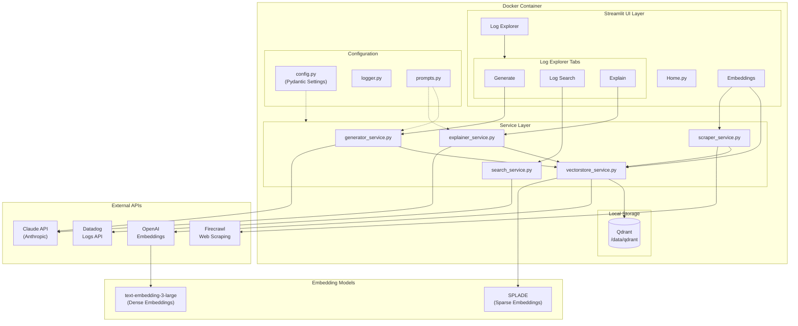

# Natural Language Log Explorer

**An AI-powered toolkit for Datadog Logs, generate queries from plain English, execute searches, and get intelligent explanations with RAG-enhanced context.**

Transform natural language into Datadog Log Search and DDSQL queries, execute Log Search queries against your Datadog instance, and decode complex queries back to plain English—all enhanced with context from your indexed documentation.

https://github.com/user-attachments/assets/demo.mp4

---

## Features

### Three Core Capabilities

| Feature | Description |
|---------|-------------|
| **✨ Generate** | Natural language → Log Search or DDSQL query |
| **🔍 Log Search** | Execute Log Search queries against Datadog Logs API |
| **💡 Explain** | Query or log entry → Plain English breakdown |

### RAG-Enhanced Intelligence

The app includes a knowledge base system powered by hybrid search:
- **Index documentation** from any URL (Datadog docs, internal wikis, etc.)
- **Hybrid embeddings**: Dense (OpenAI text-embedding-3-large) + Sparse (FastEmbed SPLADE)
- **RRF fusion** for optimal retrieval combining semantic and keyword search
- Context automatically injected into all AI operations

---

## Quick Start

### Docker

```bash
git clone https://github.com/yourusername/log-explorer.git
cd log-explorer
cp .env.example .env
# Add your API keys to .env

make setup
# → Opens http://localhost:8501
```

---

## Configuration

### Required Environment Variables

| Variable | Description |
|----------|-------------|
| `ANTHROPIC_API_KEY` | Claude API key |
| `ANTHROPIC_MODEL_NAME` | Claude model name |
| `ANTHROPIC_TEMPERATURE` | Temperature for generation |
| `ANTHROPIC_MAX_OUTPUT_TOKENS` | Max output tokens |
| `OPENAI_API_KEY` | OpenAI API key |
| `OPENAI_EMBEDDING_MODEL` | Embedding model name |
| `OPENAI_EMBEDDING_DIMENSIONS` | Embedding dimensions |
| `FIRECRAWL_API_KEY` | Firecrawl API key |
| `DD_API_KEY` | Datadog API key |
| `DD_APP_KEY` | Datadog Application key |
| `DD_SITE` | Datadog site |
| `QDRANT_SPARSE_EMBEDDING_MODEL` | Sparse embedding model |

---

## Architecture



**Key Components:**
- **Claude Sonnet** — Generates and explains queries using carefully crafted system prompts
- **Hybrid RAG** — Combines dense (OpenAI) + sparse (SPLADE) embeddings with RRF fusion
- **Qdrant** — Local vector database for persistent document storage
- **Firecrawl** — Web scraping service that converts pages to clean markdown
- **Datadog Logs API** — Executes queries and returns real log data

---

## Project Structure

```
log_explorer/
├── app/
│   ├── Home.py                    # Landing page with animated hero
│   ├── pages/
│   │   ├── 1_Log_Explorer.py      # Generate, Search, Explain tabs
│   │   └── 2_Embeddings.py        # RAG knowledge base management
│   ├── configs/
│   │   ├── config.py              # Pydantic settings
│   │   └── logger.py              # Logging configuration
│   ├── services/
│   │   ├── generator_service.py   # NL → Log Search / DDSQL
│   │   ├── search_service.py      # Execute queries via Datadog API
│   │   ├── explainer_service.py   # Query/Log → Plain English
│   │   ├── vectorstore_service.py # Qdrant hybrid search
│   │   └── scraper_service.py     # Firecrawl + text chunking
│   ├── prompts.py                 # System prompts for Claude
│   ├── renderings.py              # SVG workflow diagrams
│   └── scripts/
│       └── generate_logs.py       # Sample log generator
├── Dockerfile
├── docker-compose.yml
├── pyproject.toml
├── Makefile
├── .env.example
└── README.md
```

---

## Example Queries

### Generate: Log Search Query

| Ask this... | Get this query |
|-------------|----------------|
| "Failed login attempts" | `@evt.name:authentication @evt.outcome:failure` |
| "Slow requests over 2 seconds" | `@duration:>2000000000` |
| "Failed logins from external IPs" | `@evt.name:authentication @evt.outcome:failure NOT @network.client.ip:10.* NOT @network.client.ip:192.168.* NOT @network.client.ip:172.16.*` |

### Generate: DDSQL Query

| Ask this... | Get this query |
|-------------|----------------|
| "Error count by service" | `SELECT service, COUNT(*) as error_count FROM dd.logs(filter => 'status:error', columns => ARRAY['service']) AS (service VARCHAR) GROUP BY service ORDER BY error_count DESC` |
| "Average response time per endpoint Log data" | `SELECT json_extract_path_text(attributes, 'http', 'url_details', 'path') as endpoint, AVG(CAST(json_extract_path_text(attributes, 'duration') AS DECIMAL)) as avg_response_time FROM dd.logs(filter => 'source:web OR source:api', columns => ARRAY['attributes']) AS (attributes JSON) WHERE json_extract_path_text(attributes, 'http', 'url_details', 'path') IS NOT NULL GROUP BY endpoint ORDER BY avg_response_time DESC` |
| "Failed logins by country Log Data" | `SELECT json_extract_path_text(attributes, 'network', 'client', 'geoip', 'country', 'name') as country, COUNT(*) as failed_login_count FROM dd.logs(filter => 'evt.name:authentication.login status:error', columns => ARRAY['attributes']) AS (attributes JSON) GROUP BY country ORDER BY failed_login_count DESC` |

---

## Makefile Commands

```bash
make setup    # Check deps, build, run, open browser
make build    # Build Docker image
make run      # Start the app (attached)
make start    # Start the app (detached) + open browser
make stop     # Stop the app
make logs     # View container logs
make restart  # Restart the app
make clean    # Remove containers and images
```

---

## Tech Stack

| Component | Technology |
|-----------|------------|
| **UI** | Streamlit |
| **LLM** | Claude Sonnet (Anthropic) |
| **Dense Embeddings** | OpenAI text-embedding-3-large |
| **Sparse Embeddings** | FastEmbed SPLADE |
| **Vector Store** | Qdrant (local mode) |
| **Web Scraping** | Firecrawl |
| **Text Splitting** | LangChain RecursiveCharacterTextSplitter |
| **Datadog Integration** | datadog-api-client |

---

## License

MIT License — see [LICENSE](LICENSE) for details.
